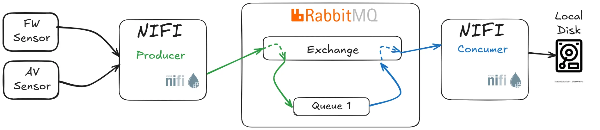

# Real-World Data Pipeline with RabbitMQ, NiFi, Prometheus & Grafana

Welcome to the **Real-World Data Pipeline** project!  
This repository includes all the necessary files to deploy a lightweight yet fully functional data pipeline using:

- 🐇 **RabbitMQ** – for message queuing  
- 🌀 **Apache NiFi** – for data flow and routing  
- 📈 **Prometheus** – for metrics collection  
- 📊 **Grafana** – for dashboard visualization  

Everything is deployed using **Docker Compose**, making it easy to set up, run, and explore — ideal for POCs, training environments, or real-world lightweight deployments.

---

## 📁 Repository Contents

- **RabbitMQ Docker Compose Setup**: Located in the `rabbitmq` folder. This includes a basic RabbitMQ setup.
- **Prometheus & Grafana Monitoring**: A complete monitoring stack including a `monitor-docker-compose.yml` file, pre-configured dashboards, and Prometheus targets.
- **Example Data Files**: Located under `nifi/input-sample` for testing the pipeline end-to-end.

---

## 📖 Reference Blog

For a full walkthrough, read the detailed step-by-step blog post:

👉 [Build a Real-World Data Pipeline with RabbitMQ, NiFi, Prometheus & Grafana](https://medium.com/@david-dudu-zbeda/how-to-build-a-real-world-data-pipeline-using-rabbitmq-nifi-prometheus-grafana-c4b0c9842f35)

👉 [Check out the LinkedIn post that shares the story behind this POC]([https://www.linkedin.com/posts/davidzbeda](https://www.linkedin.com/posts/davidzbeda_rabbitmq-kafka-apachenifi-activity-7318153408060755970-sBLB?utm_source=share&utm_medium=member_desktop&rcm=ACoAAAEesQMBPLQwNtIHjRXj9ayUxruLsTnMveg))

This blog covers:
- Why RabbitMQ was chosen over Kafka
- Architecture decisions
- How to integrate NiFi as both producer and consumer
- How to add monitoring and visualize flow metrics

---

## 🔗 Repository URL

Clone or browse the project here:  
[Real-World RabbitMQ Data Pipeline on GitHub](https://github.com/dzbeda/rabbitmq.git)

---

## 🤝 Connect on LinkedIn & Medium

Stay updated on DevOps, system integration, observability, and hands-on guides:

- LinkedIn: [www.linkedin.com/in/davidzbeda](https://www.linkedin.com/in/davidzbeda)  
- Medium: [https://medium.com/@david-dudu-zbeda](https://medium.com/@david-dudu-zbeda)

---

**✍️ David (Dudu) Zbeda**

